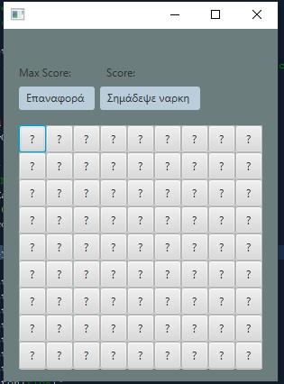
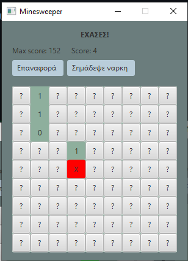
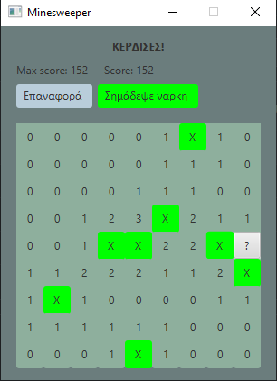

# minesweeper
A Java FXML assignment for a university class. (the UI is in Greek)

The assignment was graded with 7/10

# Screenshots:

 

# How to run:

Unfortunatly I don't have an .exe file. You have to download the project, open it in an editor (NetBeans) and run the project.
